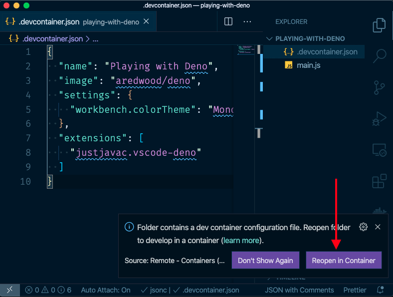
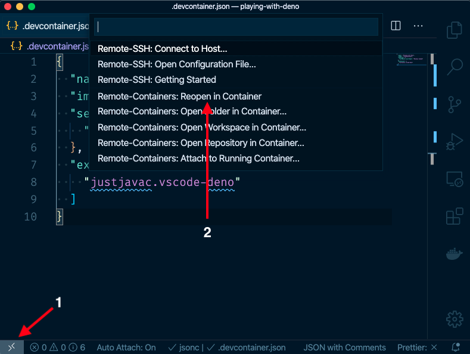
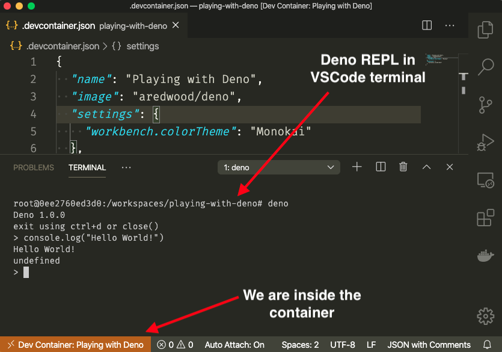

En este artículo, quiero hablarte acerca de [Visual Studio Code Remote - Containers](https://marketplace.visualstudio.com/items?itemName=ms-vscode-remote.remote-containers). Una extensión de VSCode que nos permite desarrollar dentro de un contenedor de Docker. Lo uso principalmente para:

1. Crear entornos de desarrollo que puedo compartir con mis compañeros de equipo.

1. Probar nuevas tecnologías.

Para demostrar lo fácil que es usar la extensión, creemos un entorno de desarrollo que nos permita probar [Deno](https://deno.land/).

## Prerrequisitos

Necesitas tener las siguientes herramientas instaladas:

- [Docker](https://docs.docker.com/)

- [Visual Studio Code](https://code.visualstudio.com/Download)

- [Visual Studio Code Remote - Containers](https://marketplace.visualstudio.com/items?itemName=ms-vscode-remote.remote-containers)

## Inicio

Vamos a crear una nueva carpeta, llamaré a la mía `playing-with-deno`, y dentro de esta crearemos un archivo llamado` .devcontainer.json`.

```bash
mkdir playing-with-deno
cd playing-with-deno
touch .devcontainer.json
```

Ahora, pega lo siguiente dentro del archivo `.devcontainer.json`:

```json
{
  "name": "Playing with Deno",
  "image": "aredwood/deno",
  "settings": {
    "workbench.colorTheme": "Monokai"
  },
  "extensions": [
    "denoland.vscode-deno"
  ]
}
```

Aquí está la descripción de cada propiedad en el json:

- **name:** un nombre para el contenedor. Puedes usar el nombre que quieras.

- **image:** la imagen de Docker que quieres usar. Estaré usando esta de [Deno](https://hub.docker.com/r/aredwood/deno).

- **settings**: un objeto que se utilizará como configuración predeterminada de VSCode. Puedes agregar cualquier propiedad que normalmente agregarías al archivo `settings.json` de VSCode. Aquí estoy cambiando el tema de colores por diversión.

- **extensions**: un arreglo de extensiones para instalar en VSCode. Aquí estoy instalando la extensión [denoland.vscode-deno](https://marketplace.visualstudio.com/items?itemName=denoland.vscode-deno) que agrega soporte para Deno en VSCode.

> Las propiedades `settings` y `extensions` definidas en `.devcontainer.json` solo se aplicarán al VSCode abierto dentro del contenedor, una vez que lo cierres, recuperaras tu configuración previa.

> Para más información sobre todas las propiedades que puedes usar en `.devcontainer.json`, consulta la [referencia](https://code.visualstudio.com/docs/remote/containers#_devcontainerjson-reference).

Hecho esto, abre la carpeta en VSCode. Un modal aparecerá a la la esquina inferior derecha. Haz clic en el botón `Reopen in Container`.



Si el modal no aparece o se cierra demasiado rápido, también puedes hacer clic en el icono de la esquina inferior izquierda y seleccionar `Remote-Container: Reopen in Container` de la lista de comandos.



Si seguiste las instrucciones correctamente, VSCode debería reabrir y deberías ver algo similar a la imagen a continuación (para ver el REPL de Deno en la terminal de VSCode, debes abrir la terminal tu mismo):



Y eso es todo. Ahora puedes ir y jugar cuanto quieras con Deno.

> Para obtener más información sobre este tema, puedes consultar la guía [Developing inside a Container](https://code.visualstudio.com/docs/remote/containers).