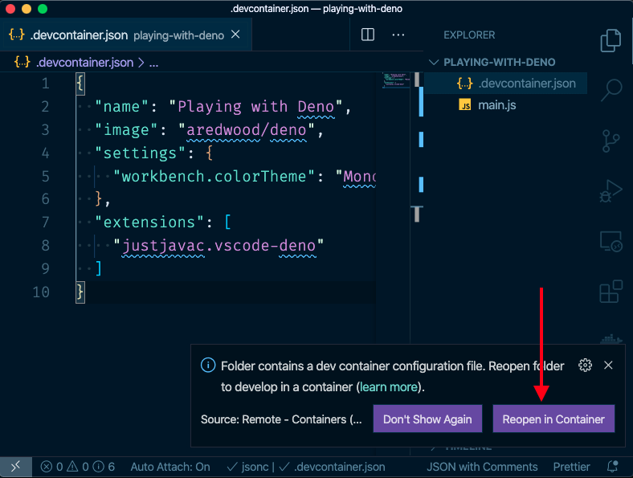
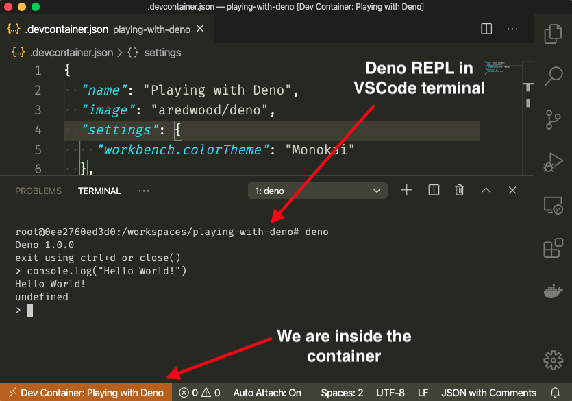

In this post, I want to talk to you about [Visual Studio Code Remote - Containers](https://marketplace.visualstudio.com/items?itemName=ms-vscode-remote.remote-containers). A VSCode extension that allows us to develop inside a Docker container. I mainly use it to:

1. Create development environments that I can share with my teammates.

1. Play around with new technologies.

To demonstrate how easy it is to use the extension, let's create a development environment that allow us to play around with [Deno](https://deno.land/).

## Prerequisites

You need to have the following tools installed:

- [Docker](https://docs.docker.com/)

- [Visual Studio Code](https://code.visualstudio.com/Download)

- [Visual Studio Code Remote - Containers](https://marketplace.visualstudio.com/items?itemName=ms-vscode-remote.remote-containers)

## Getting Started

Let's create a new folder, I’ll call mine `playing-with-deno`, and inside of it create a file called `.devcontainer.json`.

```bash
mkdir playing-with-deno
cd playing-with-deno
touch .devcontainer.json
```

Now, paste the following content inside the `.devcontainer.json` file:

```json
{
  "name": "Playing with Deno",
  "image": "aredwood/deno",
  "settings": {
    "workbench.colorTheme": "Monokai"
  },
  "extensions": [
    "denoland.vscode-deno"
  ]
}
```

Here is the description of every property in the json:

- **name:** a display name for the container. You can use whatever name you want.

- **image:** the Docker image that you want to use. Will be using this [Deno](https://hub.docker.com/r/aredwood/deno) one.

- **settings**: an object that will be used as VSCode default settings. You can add any setting you would normally add to VSCode `settings.json` file. Here I am changing the color theme for fun.

- **extensions**: an array of extensions that you want to be installed into VSCode. Here I am installing the extension [denoland.vscode-deno](https://marketplace.visualstudio.com/items?itemName=denoland.vscode-deno) that adds Deno support to VSCode.

> The `settings` and `extensions` properties defined in `.devcontainer.json` will only be applied to the VSCode opened inside the container, once you close it you’ll have your normal config back.

> For more information about all the properties that you can use in `.devcontainer.json` check the [reference](https://code.visualstudio.com/docs/remote/containers#_devcontainerjson-reference).

With that done, go ahead and open the folder in VSCode. A modal will appear to the right. Click the `Reopen in Container` button.



If the modal doesn't show up or it closes too fast, you can also click the lower-left corner icon and select `Remote-Container: Reopen in Container` from the commands list.


If you followed the instructions correctly, VSCode should reopen and, you should see something similar to the image below (to see the Deno REPL in the VSCode terminal, you'll have to open the terminal yourself):



And that's all. Now you can go and play with Deno to your heart's content.

> For more information about this subject, check the guide [Developing inside a Container](https://code.visualstudio.com/docs/remote/containers).