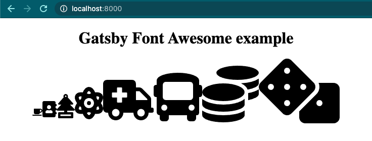
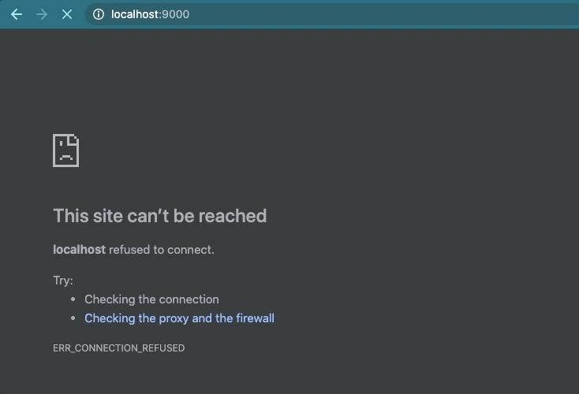

En esta artículo, te mostraré cómo agregar Font Awesome a un sitio web de Gatsby.

## Inicio

Comencemos creando un proyecto de Gatsby y agregando todas las dependencias necesarias:

```bash
mkdir gatsby-fontawesome-example
cd gatsby-fontawesome-example
# Crea el archivo package.json
npm init -y
# Instala las dependencias de Gatsby y Font Awesome
npm i --save gatsby react react-dom
npm i --save @fortawesome/fontawesome-svg-core
npm i --save @fortawesome/free-solid-svg-icons
npm i --save @fortawesome/react-fontawesome
# Crea la página de inicio
mkdir -p src/pages && touch src/pages/index.js
```

> Para más información sobre cómo [crear un sitio web de Gatsby](https://www.gatsbyjs.org/docs/setting-up-gatsby-without-gatsby-new/) y [usar Font Awesome en una aplicación de React](https://fontawesome.com/how-to-use/on-the-web/using-with/react) consulte la documentación.

Agreguemos los siguientes scripts al `package.json`:

```json
"scripts": {
  "develop": "gatsby develop",
  "build": "gatsby build",
  "serve": "gatsby serve"
}
```

Y peguemos el siguiente código en el archivo `src/pages/index.js`:

```javascript
import React from 'react'
import { FontAwesomeIcon } from '@fortawesome/react-fontawesome'
import {
  faCoffee,
  faAddressBook,
  faAirFreshener,
  faAmbulance,
  faAtom,
  faBus,
  faCoins,
  faDice,
} from '@fortawesome/free-solid-svg-icons'

const IndexPage = () => (
  <main
    style={{
      maxWidth: '608px',
      margin: '0 auto',
    }}
  >
    <h1 style={{ textAlign: 'center' }}>
      Gatsby Font Awesome example
    </h1>
    <div>
      <FontAwesomeIcon icon={faCoffee} size="1x" />
      <FontAwesomeIcon icon={faAddressBook} size="2x" />
      <FontAwesomeIcon icon={faAirFreshener} size="3x" />
      <FontAwesomeIcon icon={faAtom} size="4x" />
      <FontAwesomeIcon icon={faAmbulance} size="5x" />
      <FontAwesomeIcon icon={faBus} size="6x" />
      <FontAwesomeIcon icon={faCoins} size="7x" />
      <FontAwesomeIcon icon={faDice} size="8x" />
    </div>
  </main>
)

export default IndexPage
```

Aquí importamos el componente `FontAwesomeIcon` y todos los íconos que usaremos (esta técnica se llama [explicit import](https://github.com/FortAwesome/react-fontawesome#explicit-import), pero puedes usar [build a library](https://github.com/FortAwesome/react-fontawesome#build-a-library-to-reference-icons-throughout-your-app-more-conveniently) si lo prefieres). Renderizamos todos los íconos y colocamos la propiedad `size` para cambiarles el tamaño.

Ahora, corramos la aplicación para ver qué tenemos. En la terminal ejecutamos: `npm run develop`. La aplicación debería correr en la url [http://localhost:8000](http://localhost:8000).



Se ve bien pero hay un problema. Para verlo, necesitamos ejecutar la versión de producción de la aplicación. Detengamos la aplicación y ejecutemos el siguiente comando: `npm run build && npm run serve`. La aplicación debería correr en la url [http://localhost:9000](http://localhost:9000).



¿Qué está pasando aquí 🤔 ? Haz clic derecho en la página y selecciona _Ver código fuente de la página_ (estoy usando Chrome). Busca el atributo `class` de las etiquetas `svg`. Verás que hay un montón de clases. Ahora, ve a la etiqueta `header` e intente encontrar una etiqueta `style`. Debido a que Font Awesome inserta sus estilos cuando se ejecuta el código _JavaScript_, no hay ninguna. Y por esta razón, cuando la página carga, por una fracción de segundo, los íconos están ahí sin estilos.

Solucionar este problema no es difícil. Una solución podría ser deshabilitar la [inserción automática de CSS](https://fontawesome.com/how-to-use/javascript-api/setup/configuration#autoaddcss) y configurar los estilos de los iconos manualmente usando las propiedades `className` y `style`.

```javascript
import { config } from '@fortawesome/fontawesome-svg-core'
// Deshabilita la inserción automática de CSS
config.autoAddCss = false

//...

<FontAwesomeIcon icon={faCoffee}
  className="YOUR-CLASSES"
  style={{
    // YOUR STYLES
  }}
/>
```

Otra solución podría ser insertar los estilos en tiempo de compilación utilizando algunas de las [APIs de renderizado del servidor de Gatsby](https://www.gatsbyjs.org/docs/ssr-apis/). Y aunque hacer esto no sería difícil, no tenemos porqué hacerlo. Ya existe un complemento que lo hace: [gatsby-plugin-fontawesome-css](https://github.com/jzabala/gatsby-plugin-fontawesome-css) (soy el autor del complemento).

Para usarlo, solo necesitamos instalar el complemento y agregarlo a `gatsby-config.js`.

```bash
# Instala el complemento
npm install --save gatsby-plugin-fontawesome-css
# Crea un archivo llamado gatsby-config.js en la carpeta raíz
touch gatsby-config.js
```

Abramos `gatsby-config.js` y peguemos:

```javascript
module.exports = {
  plugins: [`gatsby-plugin-fontawesome-css`],
}
```

> [Repositorio](https://github.com/jzabala/gatsby-plugin-fontawesome-css/tree/master/example) del proyecto de ejemplo.

Y eso es todo. Ahora la aplicación funcionara como se espera en modo de desarrollo y producción. ¡Disfruta!